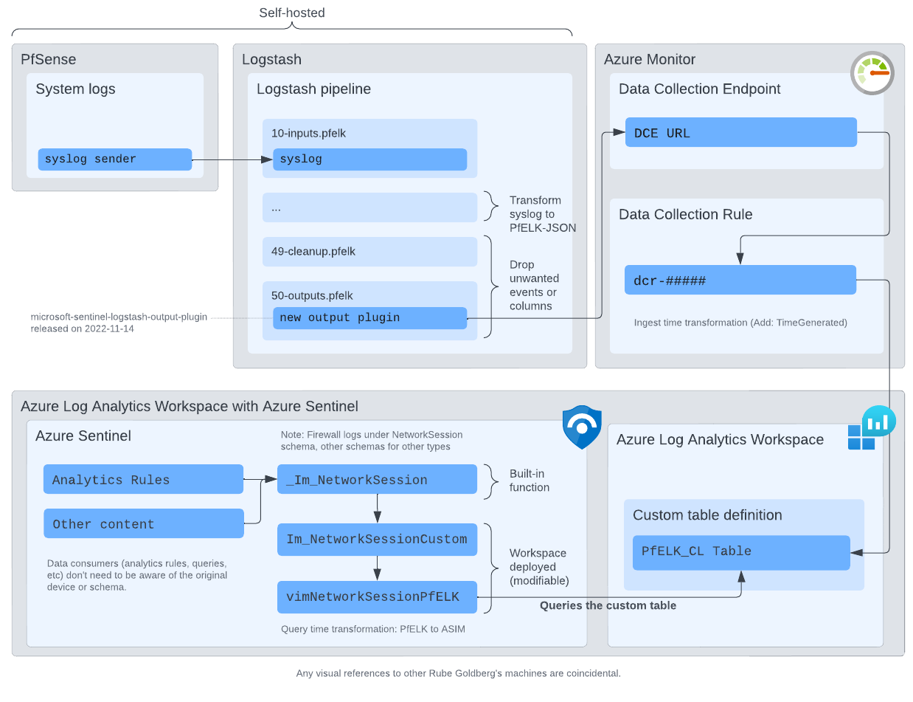

# Install instructions

Note: instructions focus on firewall logs, as that's currently only item
there's a Sentinel ASIM parser for.

## PfSense

    1. Configure remote logging with syslog e.g. using [Netgate's guide](https://docs.netgate.com/pfsense/en/latest/monitoring/logs/remote.html)
    2. Point logs to your logstash

## PfELK / Logstash

    The needed part here is the Logstash configuration.

    1. If you use PfELK, you only need to add output plugin and add a mutator for "type" column
    2. 

