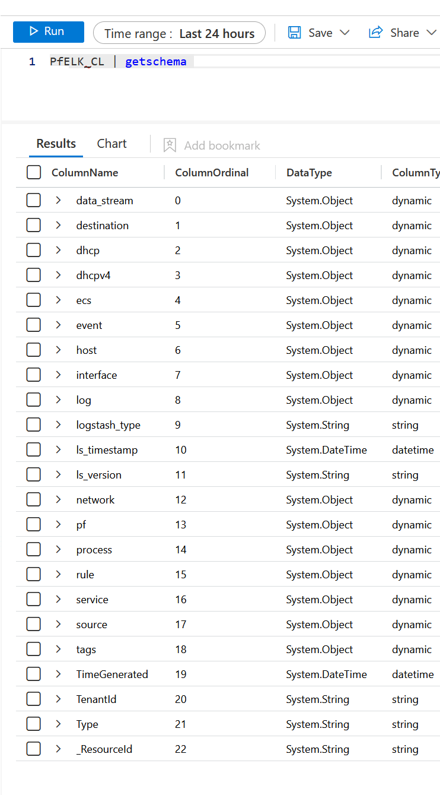

# PfELK->Sentinel Install instructions

Note: instructions focus on firewall logs, as that's currently only item
there's a Sentinel ASIM parser for.

## Before you begin: Alternatives

Before you begin: An alternative approach for connecting pfsense logs to Sentinel is to use Rsyslog. PfSense -> Rsyslog -> CEF (CommonEventFormat), documented [here](https://github.com/Azure/Azure-Sentinel/tree/master/DataConnectors/pfsense).

If you'd rather use Logstash, then this guide might be for you.

## PfSense

1. Configure remote logging with syslog e.g. using [Netgate's guide](https://docs.netgate.com/pfsense/en/latest/monitoring/logs/remote.html)
2. Point logs to your Logstash

## Logstash (with PfELK conf)

For setting up Logstash, check [PfELK project](https://github.com/pfelk/pfelk).

For setting up the output towards Sentinel, check [in.security's post](https://in.security/2022/11/28/logstash-sentinel-round-two/).

The needed part here is the Logstash and its configuration. Main bits of the configuration are:

- syslog input for PfSense [01-inputs.pfelk](Logstash-Configuration/etc/logstash/conf.d/01-inputs.pfelk)
- remove type column [49-cleanup.pfelk](Logstash-Configuration/etc/logstash/conf.d/49-cleanup.pfelk)
- output to Azure Monitor [50-outputs.pfelk](Logstash-Configuration/etc/logstash/conf.d/50-outputs.pfelk)

If you already use PfELK, you only need to add output plugin and add a mutator for "type" column. Otherwise, you need a Logstash installation.

Note that Azure Log Analytics Workspace and Azure Sentinel is priced by the ingested data volume. Currently first month is free, and you can have up to 20 free trials per tenant [Azure Sentinel pricing](https://azure.microsoft.com/en-us/pricing/details/microsoft-sentinel/).

## From Logstash to custom Log Analytics table via Azure Monitor

Logstash -> Azure Monitor (DCE, DCR) -> Custom table in Log Analytics workspace.

Check this part from [in.security's post](https://in.security/2022/11/28/logstash-sentinel-round-two/).

When prompted for table name, use `PfELK`. This results to `PfELK_CL` table and data stream `Custom-PfELK_CL`.

## Info: Ingested data format (before transformations)

When logs flow to a table in a Log Analytics Workspace, they can be queried using KQL.

Note that:
 - the data not in the raw PfSense syslog format anymore, so existing PfSense KQL parsers don't work. I also didn't find any, which lead to working on this repo.
 - the data format is not the same as in [noodlemctwoodle's repo](https://github.com/noodlemctwoodle/pf-azure-sentinel)
   - I don't actually know why this is. In noodlemctwoodle's docs the data is in many `..._s` columns.
   - In any case, the KQL queries at [noodlemctwoodle's repo](https://github.com/noodlemctwoodle/pf-azure-sentinel/tree/main/KQL/pfSense/Queries) should not work directly.
 - the data is not in CommonEventFormat, so pfsense query the snippets at [Azure-Sentinel](https://github.com/Azure/Azure-Sentinel/tree/master/Parsers/pfsense) repo don't work.

Instead, the goal is to enable the use of built-in ASIM content using the custom table via [ASIM parser](https://learn.microsoft.com/en-us/azure/sentinel/normalization).

At column level, the PfELK format looks like this (before query time ASIM transformations):
 

## Info: Sentinel tranformations -- ASIM parser (`_Im_NetworkSession` for fw logs)

Goal is to be able to query PfSense firewall logs using built-in function `_Im_NetworkSession`.

`_Im_NetworkSession` queries three functions:
  - `_Im_NetworkSessionBuiltIn` - starts with underscore, which means that this is a built-in and cannot be modified
  - `Im_NetworkSessionSolutions` - this should be workspace-deployed, and won't exist before it is put there
  - `Im_NetworkSessionCustom` - likewise

## Deploy empty unifying parsers

Before querying `_Im_NetworkSession` is possible, you need to:

- Deploy those empty and missing unifying parsers to your workspace
  - [https://github.com/Azure/Azure-Sentinel/tree/master/ASIM/deploy/EmptyCustomUnifyingParsers](https://github.com/Azure/Azure-Sentinel/tree/master/ASIM/deploy/EmptyCustomUnifyingParsers)

Note: Currently [NetworkSessionDeploymentCustomUnifyingParsers](https://github.com/Azure/Azure-Sentinel/blob/master/ASIM/deploy/EmptyCustomUnifyingParsers/NetworkSessionDeploymentCustomUnifyingParsers.json) deploys only `Im_NetworkSessionCustom`, but the built-in function depends also of `Im_NetworkSessionSolutions` (see above). Looks like a bug?

## Deploy PfELK ASIM parser

Check [ARM/vimNetworkSessionPfELK.json](ARM/vimNetworkSessionPfELK.json)

az-cli

    az deployment group create --resource-group RESOURCE_GROUP --template-file vimNetworkSessionPfELK.json --parameters Workspace=LOG_ANALYTICS_WORKSPACE

## Include `vimNetworkSessionPfELK`

Now you should have `Im_NetworkSessionCustom` and `vimNetworkSessionPfELK` as workspace deployed functions.

Add `vimNetworkSessionPfELK` to `Im_NetworkSessionCustom`

# Ready

When you get familiar results by querying `_Im_NetworkSession`, we are ready.
