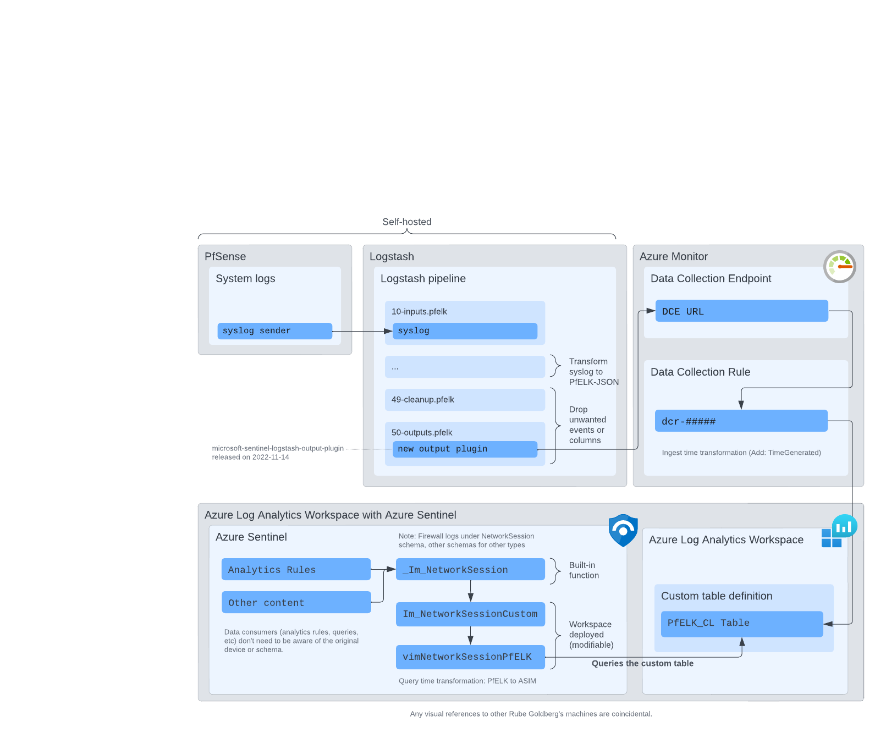

# pfelk-azure-sentinel

Building on top of noodlemctwoodle's pf-azure-sentinel

## Intro

This repo is for users who want to ship their logs from PfSense
to Azure Sentinel.

If you already use PfELK, adding Sentinel output to Logstash
requires only minor configuration changes.

If you don't yet use PfELK, and only want to ship logs, using
the Logstash configuration from PfELK for parsing + shipping
PfSense logs is a ready solution.

PfSense generates logs in syslog format and two things would need
to happen before they are usable in a SIEM:

 - They need to be parsed
 - They need to be shipped

For parsing, the PfELK project has already done the heavy lifting
and maintains a set of Logstash Grok patterns and other helpful
mutations.

Using Logstash allows you also to add enrichments before ingestions.
It also allows to filter out unnecessary fields or events, which is
can be important as Sentinel is priced by the ingested data.

For shipping, there's a new Logstash plugin that can be used here
https://github.com/Azure/Azure-Sentinel/tree/master/DataConnectors/microsoft-sentinel-logstash-output-plugin

To get the data to Sentinel's ASIM format, a second round of parsing
needs to happen. Thanks to PfELK, this is easier to maintain and has
likely better performance compared to maintaining a syslog->ASIM
query time parser.

## How to use this repository

This repository serves mainly as an example.

Check PfELK repository for current configuration & parser patterns.

On top of PfELK configuration, files in this repo's etc/logstash/conf.d
files are worth checking:

- 49-cleanup.pfelk
- 50-outputs.pfelk

## Contributions

All contributions that are applicable to PfELK should go there.

## Related work & comparisons

- pfelk/pfelk
  - Main body of work for everything related to PfSense & Logstash
- noodlemctwoodle/pf-azure-sentinel (2021)
  - Uses PfELK configuration to parse PfSense logs
  - Uses `microsoft-logstash-output-azure-loganalytics` plugin to ship logs
  - Provides several Azure Sentinel KQL queries that query directly
    `psfsense_logstash_CL` table
- in.security's post:
  - https://in.security/2022/11/28/logstash-sentinel-round-two/
  - Up to date general guide for shipping logs to Sentinel using Logstash
- This repo
  - Combines the above to get the logs to Sentinel
  - Adds Azure Sentinel ASIM parser for PfELK data model
    - After deployment, the existing Azure Sentinel Analytics rules and other 
      content that uses the NetworkSession unifying parser should work
      with PfSense logs
    - https://github.com/deggis/Azure-Sentinel/blob/asim/add_networksession_pfelk/Parsers/ASimNetworkSession/Parsers/vimNetworkSessionPfELK.yaml

## License

Apache2, to be in line with

- noodlemctwoodle/pf-azure-sentinel
- pfelk/pfelk

## Credits

- This repo continues the work of noodlemctwoodle/pf-azure-sentinel
- Both build on top of pfelk/pfelk